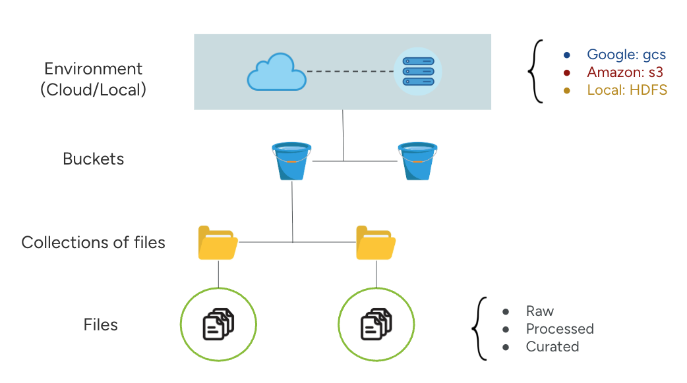

# Lakehouse App Python Lib

This python lib supports the access to the lakehouse app via python scripts

## 🔨 Requirements

- `pandas>=2.2.2`
- `openpyxl>=3.1.5`
- `html5lib>=1.1`
- `pyarrow>=14.0.0`
- `fastparquet>=2024.11.0`
- `requests>=2.32.3`
- `pydantic>=2.11.4`


## 📌 Installation and usage

To install the library enter the following command:

```python
pip install lakehouselib
```

If the library is hosted in TestPyPI and does not have an official version available at PyPI yet run the command

```python
pip install -i https://test.pypi.org/simple/ --extra-index-url https://pypi.org/simple lakehouselib
```

To import the main class add the following code into your script:

```python
from lakehouse import LakehouseClient
```

To use the lakehouse functionalities create an instance of LakehouseClient by running:

```python
client = LakehouseClient("lakehouse_app_url")
```

## 🚨 Supported Environments for Data Storage

1. Google Cloud Storage (gcs)
2. Amazon S3 (s3)
3. Self Hosted Apache Hadoop (hdfs)

## 🏠 Lakehouse Data Storage Structure

The lakehouse storage structure is divided in three levels: 
- (1) The bucket where the collections of files will be phisically stored, 
- (2) The collections are a logical group of files (similarly to a github repository of files grouped for the same logical purpose).
- (3) The files



## 📚 Function Index <a name="index"></a> 

### Authentication

- [client.auth()](#clientauth)

### Creating collection

- [client.create_collection()](#clientcreate_collection)

### Downloading Files

- [client.download_file()](#clientdownload_file)

### Downloading and parsing dataframe

- [client.get_dataframe()](#clientget_dataframe)

### Listing Collections, files and buckets

Collections:
- [client.list_collections()](#clientlist_collections)
- [client.list_collections_dict()](#clientlist_collections_dict)
- [client.list_collections_df()](#clientlist_collections_df)
- [client.list_collections_json()](#clientlist_collections_json)<br><br>


Files:
- [client.list_files()](#clientlist_files)
- [client.list_files_dict()](#clientlist_files_dict)
- [client.list_files_df()](#clientlist_files_df)
- [client.list_files_json()](#clientlist_files_json)<br><br>

Buckets:
- [client.list_buckets()](#clientlist_buckets)
- [client.list_buckets_dict()](#clientlist_buckets_dict)
- [client.list_buckets_df()](#clientlist_buckets_df)
- [client.list_buckets_json()](#clientlist_buckets_json)<br><br>


### Uploading data

- [client.upload_dataframe()](#clientupload_dataframe)
- [client.upload_file()](#clientupload_file)

### Basic search

- [client.search_collections_by_keyword()](#clientsearch_collections_by_keyword)
- [client.search_files_by_keyword()](#clientsearch_files_by_keyword)

### Advanced search query

- [client.search_files_query()](#clientsearch_files_query)
- [client.search_collections_query()](#clientsearch_collections_query)


## 🔧 Function Details

### `client.auth()` <a name="clientauth"></a> [_\[click here to go back to the top\]_](#index)

**Basic Example:**
```python
client.auth(email="your_email@mail.com", password="PASS")
```

**Description:**  
Authenticates the user based on login details. It returns the authentication token.

**Arguments:**

- email: A string containing the user email
- password: A string containing the user's password

---

### `client.create_collection()` <a name="clientcreate_collection"></a> [_\[click here to go back to the top\]_](#index)

**Basic Example:**
```python
client.create_collection(
  collection_name="YOUR_COLLETION_NAME", 
  storage_type="gcs", 
  bucket_name="AVAILABLE_STORAGE_BUCKET_NAME"
)
```

**Description:**  
Creates a new collection of files. Returns the collection's name.

**Arguments:**

- collection\_name: name for the new collection
- storage\_type: storage type/environment where the collection will be hosted. Values: 'gcs' for Google Cloud Storage, 's3' for Amazon S3 Storage, 'hdfs' for self-hosted apache hadoop clusters.
- bucket\_name: required to select what bucket will host the data in the system.
- collection\_description _(Optional, default: " ")_: text description. Default value is an empty string
- public _(Optional, default: False)_: marks the collection as public.
- secret _(Optional, default: False)_: marks the collection as secret.

**Returns:**

- A dictionary containing the collection item in the catalog

---

### `client.download_file()` <a name="clientdownload_file"></a> [_\[click here to go back to the top\]_](#index)

**Basic Example:**
```python
client.download_file(
  catalog_file_id="0197ead3-028c-797e-8717-5441be78a0e4", 
  output_file_dir="LOCAL_COMPUTER_PATH"
)
```

**Description:**  
Downloads a file from the lakehouse catalog using its catalog ID. Returns the local path where the file was saved.

**Parameters:**

- catalog\_file\_id: the file id
- output\_file\_dir: the local dir where the output file will be placed at

**Returns:**

- A string containing the output file address

---

### `client.get_dataframe()` <a name="clientget_dataframe"></a> [_\[click here to go back to the top\]_](#index)

**Basic Example:**
```python
client.get_dataframe(catalog_file_id="0197ead3-028c-797e-8717-5441be78a0e4")
```

**Description:**  
Get a file as a dataframe.  

**Condition:**  
Only works if the catalog marks the file as 'structured' (or file format is CSV, XLSX, TSV, JSON, MD, HTML, TEX, or PARQUET).

**Parameters:**

- catalogue\_file\_id: the file ID in the catalog

**Returns:**

- It returns a pandas dataframe of the desired file

---

### `client.list_collections()` <a name="clientlist_collections"></a> [_\[click here to go back to the top\]_](#index)

**Basic Example:**
```python
client.list_collections()
```

**Description**
List all available collections.

**Arguments**

- sort\_by\_key _(Optional, default: "inserted\_at")_: String containing the key parameter to be the sorting reference, default is inserted_at (date of insertion)
- sort\_desc _(Optional, default: True)_: Boolean value indicating TRUE or FALSE for sorting descendently

**Returns**
Returns a table-formatted string with the collections records

---

### `client.list_collections_dict()` <a name="clientlist_collections_dict"></a> [_\[click here to go back to the top\]_](#index)

**Basic Example:**
```python
client.list_collections_dict()
```

**Description**
List all available collections.

**Arguments**

- sort\_by\_key _(Optional, default: "inserted\_at")_: String containing the key parameter to be the sorting reference, default is inserted_at (date of insertion)
- sort\_desc _(Optional, default: True)_: Boolean value indicating TRUE or FALSE for sorting descendently

**Returns**
Returns a list of python dictionaries with the collections records

---

### `client.list_collections_df()` <a name="clientlist_collections_df"></a> [_\[click here to go back to the top\]_](#index)

**Basic Example:**
```python
client.list_collections_df()
```

**Description**
List all available collections.

**Arguments**

- sort\_by\_key _(Optional, default: "inserted\_at")_: String containing the key parameter to be the sorting reference, default is inserted_at (date of insertion)
- sort\_desc _(Optional, default: True)_: Boolean value indicating TRUE or FALSE for sorting descendently

**Returns**
Returns a pandas dataframe with the collections records

---

### `client.list_collections_json()` <a name="clientlist_collections_json"></a> [_\[click here to go back to the top\]_](#index)

**Basic Example:**
```python
client.list_collections_json()
```

**Description**
List all available collections.

**Arguments**

- sort\_by\_key _(Optional, default: "inserted\_at")_: String containing the key parameter to be the sorting reference, default is inserted_at (date of insertion)
- sort\_desc _(Optional, default: True)_: Boolean value indicating TRUE or FALSE for sorting descendently

**Returns**
Returns a json-formatted string with the collections records

---

### `client.list_files()` <a name="clientlist_files"></a> [_\[click here to go back to the top\]_](#index)

**Basic Example:**
```python
client.list_files()
```

List files in a given collection or bucket.  
**Description**:

Useful for exploring available resources before querying or downloading.

**Arguments**

- include\_raw _(Optional, default: True)_: Boolead flag indicating if results will whether include raw files
- include\_processed _(Optional, default: True)_: Boolead flag indicating if results will whether include processed files
- curated _(Optional, default: True)_: Boolead flag indicating if results will whether include curated files
- sort\_by\_key _(Optional, default: "iserted\_at")_: String containing the key parameter to be the sorting reference, default is inserted_at (date of insertion)
- sort\_desc _(Optional, default: True)_: Boolean value indicating True or False for sorting descendently

**Returns:**

- It returns a table-formatted string with the files in the catalog

---

### `client.list_files_dict()` <a name="clientlist_files_dict"></a> [_\[click here to go back to the top\]_](#index)

**Basic Example:**
```python
client.list_files_dict()
```

List files in a given collection or bucket.  
**Description**:

Useful for exploring available resources before querying or downloading.

**Arguments**

- include\_raw _(Optional, default: True)_: Boolead flag indicating if results will whether include raw files
- include\_processed _(Optional, default: True)_: Boolead flag indicating if results will whether include processed files
- curated _(Optional, default: True)_: Boolead flag indicating if results will whether include curated files
- sort\_by\_key _(Optional, default: "iserted\_at")_: String containing the key parameter to be the sorting reference, default is inserted_at (date of insertion)
- sort\_desc _(Optional, default: True)_: Boolean value indicating True or False for sorting descendently

**Returns:**

- It returns a list of python dictionaries with the files in the catalog

---

### `client.list_files_df()` <a name="clientlist_files_df"></a> [_\[click here to go back to the top\]_](#index)

**Basic Example:**
```python
client.list_files_df()
```

List files in a given collection or bucket.  
**Description**:

Useful for exploring available resources before querying or downloading.

**Arguments**

- include\_raw _(Optional, default: True)_: Boolead flag indicating if results will whether include raw files
- include\_processed _(Optional, default: True)_: Boolead flag indicating if results will whether include processed files
- curated _(Optional, default: True)_: Boolead flag indicating if results will whether include curated files
- sort\_by\_key _(Optional, default: "iserted\_at")_: String containing the key parameter to be the sorting reference, default is inserted_at (date of insertion)
- sort\_desc _(Optional, default: True)_: Boolean value indicating True or False for sorting descendently

**Returns:**

- It returns a pandas dataframe with the files in the catalog

---

### `client.list_files_json()` <a name="clientlist_files_json"></a> [_\[click here to go back to the top\]_](#index)

**Basic Example:**
```python
client.list_files_json()
```

List files in a given collection or bucket.  
**Description**:

Useful for exploring available resources before querying or downloading.

**Arguments**

- include\_raw _(Optional, default: True)_: Boolead flag indicating if results will whether include raw files
- include\_processed _(Optional, default: True)_: Boolead flag indicating if results will whether include processed files
- curated _(Optional, default: True)_: Boolead flag indicating if results will whether include curated files
- sort\_by\_key _(Optional, default: "iserted\_at")_: String containing the key parameter to be the sorting reference, default is inserted_at (date of insertion)
- sort\_desc _(Optional, default: True)_: Boolean value indicating True or False for sorting descendently

**Returns:**

- It returns a json-formatted string with the files in the catalog

---

### `client.list_buckets()` <a name="clientlist_buckets"></a> [_\[click here to go back to the top\]_](#index)

**Basic Example:**
```python
client.list_buckets()
```

List all buckets accessible by the user.  
**Description**:
Buckets represent logical data partitions or storage spaces.

**Returns:**

- It returns a table-formatted string containing all the storage buckets in the system

---

### `client.list_buckets_dict()` <a name="clientlist_buckets_dict"></a> [_\[click here to go back to the top\]_](#index)

**Basic Example:**
```python
client.list_buckets_dict()
```

List all buckets accessible by the user.  
**Description**:
Buckets represent logical data partitions or storage spaces.

**Returns:**

- It returns a list of pyton dicts containing all the storage buckets in the system

---

### `client.list_buckets_df()` <a name="clientlist_buckets_df"></a> [_\[click here to go back to the top\]_](#index)

**Basic Example:**
```python
client.list_buckets_df()
```

List all buckets accessible by the user.  
**Description**:
Buckets represent logical data partitions or storage spaces.

**Returns:**

- It returns a pandas dataframe containing all the storage buckets in the system

---

### `client.list_buckets_json()` <a name="clientlist_buckets_json"></a> [_\[click here to go back to the top\]_](#index)

**Basic Example:**
```python
client.list_buckets_json()
```

List all buckets accessible by the user.  
**Description**:
Buckets represent logical data partitions or storage spaces.

**Returns:**

- It returns a json-formatted string containing all the storage buckets in the system

---

### `client.upload_dataframe()` <a name="clientupload_dataframe"></a> [_\[click here to go back to the top\]_](#index)

**Basic Example:**
```python
client.upload_dataframe(
  df=df_variable,
  df_name="DATASET_NAME", 
  collection_catalog_id="0197eada-cedb-77d5-8935-b319b59fae02"
)
```

Upload a pandas DataFrame to the lakehouse.

**Returns**:

Prepares a new file for upload from local storage. This operation returns the following:

- Upload token
- Credential ID
- Local dataframe file path to be uploaded

**Arguments:**

- df: Pandas dataframe to be uploaded

- df\_name:  
  The name of the dataframe (without file extension). The dataframe will be stored as a CSV file by default.

- collection\_catalog_id:  
  The identifier of the collection (from the collection catalog) where the file will be stored.

- file\_description _(Optional)_:  
  Additional description for the file. Default value is an empty string

- dataframe\_version _(Optional, default: 1)_:  
  Version number of the dataframe in the system.

- public _(Optional, default: False)_:  
  Visibility setting. If True, the dataframe will be publicly visible to all users in the catalog.

- processing\_level _(Optional, default: `raw`)_:  
  Indicates the processing level of the dataframe (e.g., `raw`, `processed`, etc.).

---

### `client.upload_file()` <a name="clientupload_file"></a> [_\[click here to go back to the top\]_](#index)

**Basic Example:**
```python
client.upload_file(
  local_file_path="/Desktop/files/sample/sequences.fasta", 
  final_file_name="sequences_dengue.fasta",
  collection_catalog_id="0197eada-cedb-77d5-8935-b319b59fae02",
  file_category="unstructured"
)
```

**Description:**  
Uploads a local file to the lakehouse

**Arguments:**

- local\_file\_path: the local path to the file to be uploaded
- final\_file\_name: the output file name in the storage
- collection\_catalog\_id: the collection identifier, from the collection catalog, where the file will be placed
- file\_category: the file class must indicate if the file is 'structured' or 'unstructured'; default is 'unstructured'
- file\_description _(Optional, default: "")_: Additional description for the file
- file\_version _(Optional, default: 1)_: Version number for version control
- public _(Optional, default: False)_: If public, the file is visible to all users
- processing\_level _(Optional, default: "raw")_: The processing level ("raw", "processed", "curated")

**Returns:**

- A dictionary containing the file id in the catalog and the file name


---

### `client.search_collections_by_keyword()` <a name="clientsearch_collections_by_keyword"></a> [_\[click here to go back to the top\]_](#index)

**Basic Example**:

```python
client.search_collections_by_keyword(keyword="clinical reports")
```

**Description**: Search the collections in the catalogue by keyword. Enables discovery of collections of datasets based on a specified keyword

**Arguments**:

- keyword (str): A string containing the string keyword to match with the collection names,
- output\_format _(Optional[str], default: 'table')_: A string specifying the output format, it must be one of the following formats: "dict", "table", "df" or "json". If not specified a table-formatted string will be returned

**Returns:**

- It returns the collections reccords in the specified output format.

---

### `client.search_collections_query()` <a name="clientsearch_collections_query"></a> [_\[click here to go back to the top\]_](#index)

1. The following example searches any collection that contains the word 'covid' in its name
```python
client.search_collections_query('collection_name*covid')
```

2. The following example search for any collection named `covv_patient_data`, inserted_by equals `0197eae8-bc59-7ac4-80b3-81bfec379f7e:user1@gmail.com` and inserted_at greater than `1747934722` (date in miliseconds)
```python
client.search_collections_query(
  'collection_name=covv_patient_data',
  'inserted_by=0197eae8-bc59-7ac4-80b3-81bfec379f7e:user1@gmail.com',
  'inserted_at>1747934722'
)
```

**Description**: Query the collections in the catalogue based on query parameters. Enables discovery of collections of datasets based on a specified keyword

**Arguments**:

- \*args: Strings containing the query parameters
- output\_format _(Optional[str], default: 'table')_: the result output format, it must be one of the follwing formats: "dict", "table", "df" or "json". If not specified a table-formatted string will be returned

**Returns:**

- It returns the collection records in the specified parameters

**Query Parameters List**:

- `id`
- `collection_name`
- `storage_type`
- `location`
- `inserted_by`
- `inserted_at`
- `collection_description`
- `public`

**Query String Structure**:

`QUERY_PARAMETER <OPERATOR> VALUE`

- QUERY_PARAMETER: must be one of the query parameters listed above
- OPERTOR: must be one of the following "=", ">","<", ">=", "<=" or the wildcard operator "\*" (substring match)
- VALUE: Value for each parameter


---

### `client.search_files_by_keyword()`  <a name="clientsearch_files_by_keyword"></a> [_\[click here to go back to the top\]_](#index)

**Basic Example**:

```python
client.search_files_by_keyword(keyword="genome")
```

**Description**: Search the files in the catalogue by keyword and returns any files that contain the given keyword in its name. Enables discovery of files of datasets based on a specified keyword

**Arguments**:

- keyword (str): A string containing the string keyword to match with the file names,
- output\_format _(Optional[str], default: 'table')_: A string specifying the output format, it must be one of the following formats: "dict", "table", "df" or "json". If not specified a table-formatted string will be returned

**Returns:**

- It returns the files reccords in the specified output format.

---

### `client.search_files_query()` <a name="clientsearch_files_query"></a> [_\[click here to go back to the top\]_](#index)

1. The following example searches any files with the word `sequences` in its file_name.
```python
client.search_files_query('file_name*sequences')
```

2. The following example searches any file named `zika_count.csv`, inserted_at data is greater than `1747934722` (date in miliseconds), processing level is equal `raw`, and file_category equals `structured`.
```python
client.search_files_query(
  'file_name=zika_count.csv',
  'inserted_at>1747934722', 
  'processing_level=raw', 
  'file_category=structured'
)
```

**Description**: Query the files in the catalogue based on query parameters. Enables discovery of collections of datasets based on a specified keyword

**Arguments**:

- \*args: Strings containing the query parameters
- output\_format _(Optional[str], default: 'table')_: the result output format, it must be one of the follwing formats: "dict", "table", "df" or "json". If not specified a table-formatted string will be returned

**Returns:**

- It returns the collection records in the specified parameters

**Query Parameters List**:

- `id`
- `file_name`
- `file_size`
- `collection_id`
- `collection_name`
- `processing_level`
- `inserted_by`
- `inserted_at`
- `file_category`
- `file_version`
- `public`

**Query String Structure**:

`QUERY_PARAMETER <OPERATOR> VALUE`

- QUERY_PARAMETER: must be one of the query parameters listed above
- OPERATOR: must be one of the following "=", "!=", ">","<", ">=", "<=" or the wildcard operator "\*" (substring match)
- VALUE: Value for each parameter

---
